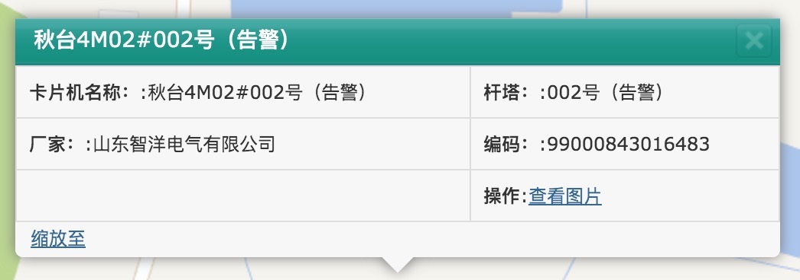

# 地下通道及电缆网精益化管理系统
## 地图功能
## 首页
1. 地图初始化默认渲染

|序列|渲染项|默认勾选|
|---|-----|-------|
|1|220kv线路|是|
|2|110kv线路|是|
|3|35kv线路|是|
|4|变电站|是|
|5|缺陷|否|
|6|隐患|否|
|7|施工道路|否|
## 在线监控
1. 地图初始化默认渲染

|序列|渲染项|默认勾选|
|---|-----|-------|
|1|220kv线路|是|
|2|110kv线路|是|
|3|35kv线路|是|
|4|变电站|否|
|5|缺陷|否|
|6|隐患|否|
|7|施工道路|否|
|8|监控摄像头|是|
2. 交互
- 搜索和点击侧边栏`表格列,定位到卡片机、地图缩放级别放大、展示对话框`
- 对话框内容如下图

|对话框操作|功能|
|--------|----|
|关闭|确定|
|查看图片|待确定|
|缩放至|待确定|
- 点击摄像头icon,`弹出对话框`
## 三维展示
## 在建工程(无)
## 运维管理
## 状态管理
## 检修管理
## 保电管理
## 带电检测(无)
